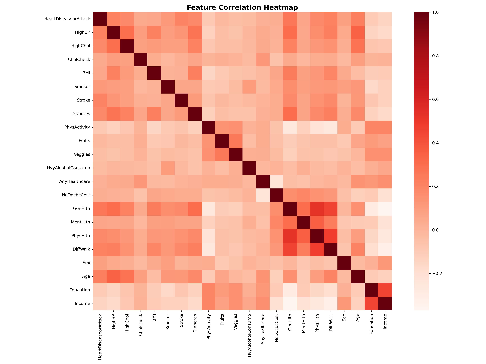
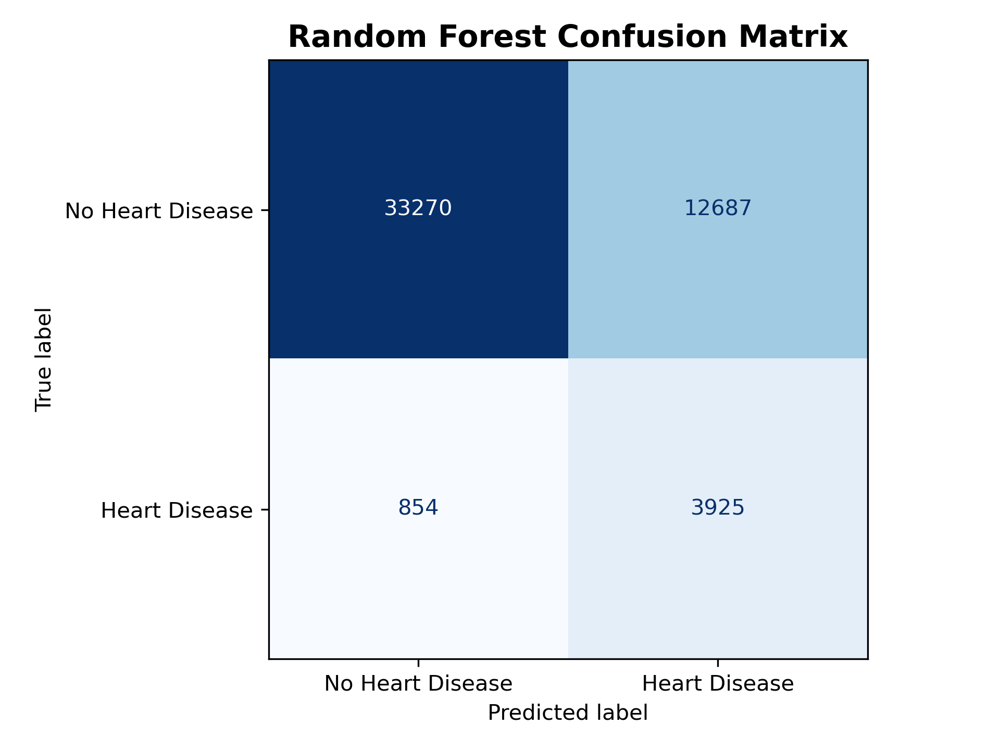
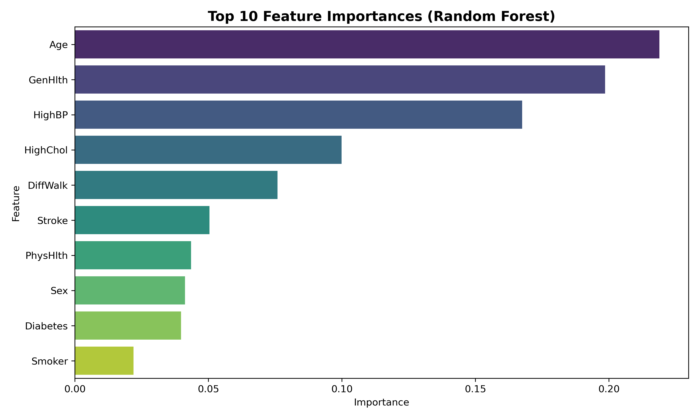
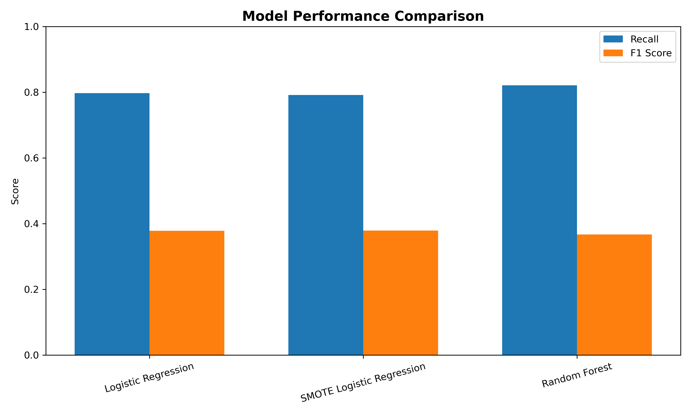

# Heart Risk Prediction

## Project Summary
Built a classification pipeline to flag individuals at risk of heart disease using the CDC Behavioral Risk Factor Surveillance System (BRFSS) dataset (253,680 respondents, 22 health and lifestyle features). The goal was early-risk screening, so the modeling strategy prioritized recall (catching positive cases) over overall accuracy. I evaluated multiple linear and ensemble models, feature-selection techniques, and imbalance-mitigation strategies to find the most reliable approach for medical triage.

## Technical Approach

### Data Processing
- **Source**: Kaggle BRFSS heart disease survey (all numeric, already encoded).
- **Integrity checks**: No missing values; duplicates retained because different respondents can share identical feature profiles.
- **Train/test split**: Stratified 80/20 split to preserve the positive-class prevalence (~8.6%).
- **Scaling**: StandardScaler applied wherever linear models (LogReg, SVM, LDA/QDA) were used.

### Feature Exploration
- **Correlation Analysis**: No pair exceeded 0.52 correlation, indicating low multicollinearity; therefore minimal dimensionality reduction was necessary.
- **Selection Experiments**: SelectKBest (mutual information), LASSO, and sequential forward/backward selection all confirmed that most variables contribute information. LASSO kept every feature (small coefficients for low-impact signals such as heavy alcohol consumption or BMI).
- **Domain Signals**: Age, self-reported general health, diagnosed hypertension/cholesterol, and difficulty walking consistently emerged as top predictors.

### Modeling & Evaluation
- **Baselines**: Logistic Regression (class_weight='balanced') and its SMOTE-resampled variant to benchmark linear decision boundaries.
- **Ensembles**: Random Forest with grid-searched depth/estimators to capture non-linear interactions; XGBoost (baseline + tuned) for further experimentation.
- **Other Classifiers**: SVM, LDA, QDA to validate performance boundaries; stepwise feature selection assessed both linear and quadratic discriminant models.
- **Metrics**: Accuracy, Recall, F1, and AUC-ROC, with primary emphasis on recall to minimize false negatives (missed at-risk patients).
- **Cross-Validation**: 5-fold CV on training data for Random Forest and QDA to ensure stability.

## Results & Performance

| Model                       | Accuracy | Recall | F1 Score | AUC-ROC |
|-----------------------------|---------:|-------:|---------:|--------:|
| Logistic Regression         | 0.7534   | 0.7970 | 0.3785   | 0.8470  |
| SMOTE Logistic Regression   | 0.7557   | 0.7918 | 0.3791   | 0.8462  |
| Random Forest (selected)    | 0.7331   | **0.8213** | 0.3670 | 0.8452  |
| LASSO Logistic Regression   | 0.9071   | 0.1258 | 0.2033   | 0.8469  |
| XGBoost (tuned)             | 0.9023   | 0.1475 | 0.2215   | 0.8168  |
| LDA                         | 0.9018   | 0.1990 | 0.2764   | 0.8446  |
| QDA                         | 0.8327   | 0.4794 | 0.3506   | 0.8047  |

### Model Selection
- **Random Forest** delivered the highest recall (0.82) while maintaining competitive AUC (0.845), making it the best screening model when missing positives is unacceptable.
- **SMOTE Logistic Regression** offered similar recall to the baseline but provided interpretability and slightly higher accuracy—useful when linear explanations are required.
- **SVM/XGBoost** achieved high accuracy but extremely low recall, demonstrating why accuracy alone is a risky metric on imbalanced medical data.

### Feature Insights
- Importance ranking from Random Forest highlighted **Age**, **General Health Rating**, **High Blood Pressure**, **High Cholesterol**, and **Difficulty Walking** as the dominant risk signals.
- Lifestyle variables (smoking, diabetes, physical activity) still contributed predictive power but with smaller marginal gains.

## Visualizations

### Population-Level Patterns

Correlations confirm low redundancy between features, justifying the decision to keep the full variable set.

### Model Diagnostics

Random Forest catches most positive cases (lower-left cell) at the cost of extra false positives—acceptable for preventive screening.

### Feature Attribution

Age and self-reported health dominate the risk score, while clinical diagnoses (HighBP, HighChol, Stroke, Diabetes) provide strong supporting signals.

### Performance Comparison

Recall/F1 bars highlight why Random Forest was selected (highest recall) and how SMOTE affects linear models.

## Findings & Impact
- Imbalanced medical datasets demand recall-centric evaluation; models optimizing accuracy alone can suppress the minority class.
- Ensemble methods are better suited for capturing non-linear interactions in patient demographics and lifestyle factors.
- Feature selection had minimal impact because variables are weakly correlated and encode distinct risk aspects.
- The final Random Forest model can support health teams by triaging high-risk individuals for follow-up screenings while maintaining transparency through feature importance plots.

This project demonstrates end-to-end ML workflow skills: large-scale data handling, imbalance mitigation, rigorous model comparison, and communication of clinically relevant insights with supporting visuals.

